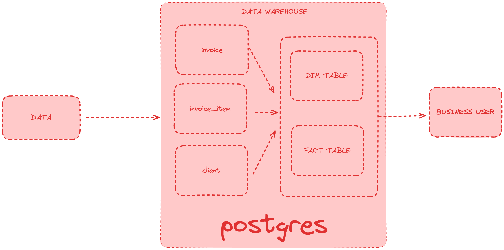

# Download Potgresql
https://www.enterprisedb.com/download-postgresql-binaries

# Using Docker
1. Download and install [docker](https://docs.docker.com/desktop/install/windows-install/) and [docker-compose](https://docs.docker.com/compose/install/)
2. Run `docker-compose up -d`

